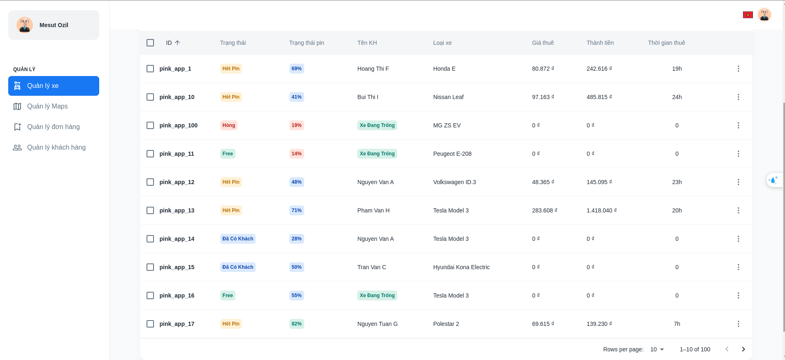
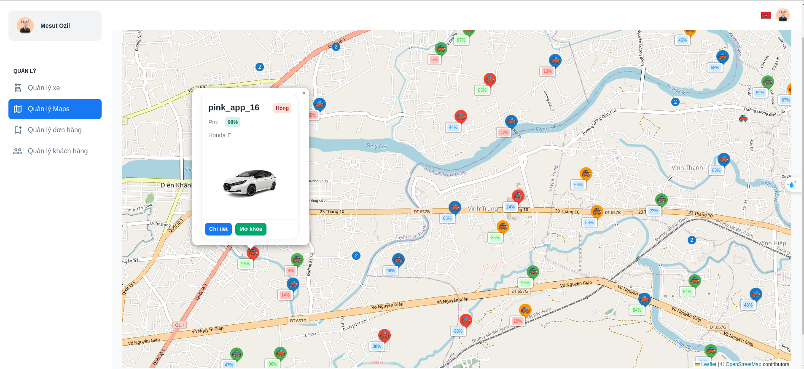
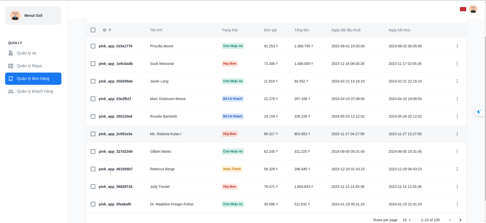
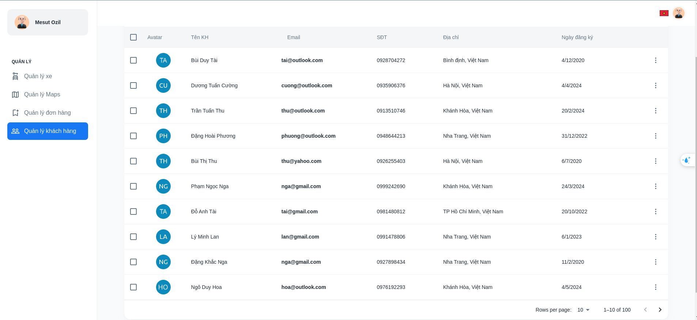

# CMS Manager OSM and Vehicle management 🗺️

## Vehicle

## 2. Maps

## 3. Orders

## 4. Users

## Project Overview

This project involves creating a vehicle booking system that integrates OpenStreetMap (OSM) for mapping and location services. The project aims to provide a seamless experience for users to book various types of vehicles using a web application built with React.

## Key Features

1. **OpenStreetMap Integration:**

   - Utilize OSM for displaying maps and location-based services.
   - Allow users to view and select pick-up and drop-off locations on an interactive map.
   - Provide real-time location updates for vehicles.

2. **Vehicle Management:**

   - Display a fleet of vehicles, including cars, bikes, and electric scooters.
   - Show vehicle availability, status, and other relevant details.
   - Allow users to filter and search for vehicles based on their preferences and availability.

3. **User Interface:**

   - Build a user-friendly interface with React for seamless navigation and interaction.
   - Provide features for users to create accounts, log in, and manage their bookings.
   - Implement a responsive design to ensure compatibility across various devices.

4. **Booking System:**
   - Allow users to search for available vehicles based on their location and time.
   - Provide detailed information about each vehicle, including pricing and specifications.
   - Enable users to book vehicles and receive confirmation notifications.

## Technologies Used

- **Frontend:** React, HTML, CSS, JavaScript
- **Mapping Services:** OpenStreetMap API

## Goals

- To provide an efficient and user-friendly vehicle booking system.
- To utilize OSM for accurate and interactive mapping services.
- To offer a seamless and responsive user interface.

## Timeline

- **Phase 1:** Project Planning and Requirement Analysis
- **Phase 2:** Design and Development of User Interface
- **Phase 3:** Integration of OpenStreetMap and Vehicle Management
- **Phase 4:** Implementation of Booking System
- **Phase 5:** Testing and Quality Assurance
- **Phase 6:** Deployment and User Training

## Conclusion

This project aims to deliver a comprehensive vehicle booking system leveraging OpenStreetMap for enhanced mapping capabilities and React for a robust user interface. The system will provide a seamless experience for users to book vehicles, manage bookings, and view vehicle locations.
